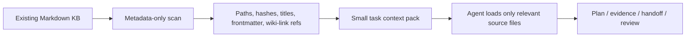

# Owledge Kit

**Durable Markdown project memory for AI agents.**

[](VERSION)
[](LICENSE)
[](#why-owledge-kit)
[](#agent-and-harness-support)

Owledge Kit gives AI agents a project memory they can actually use: plans,
evidence, reviews, handoffs, and decisions are written as local Markdown records
so context survives across sessions, tools, teams, and existing knowledgebases.

Use it with Codex, Claude Code, OpenCode, PI agents, custom harnesses, Obsidian,
or existing LLM wikis when you want agents to keep MVP plans grounded, hand off
work cleanly, and make project progress auditable without adopting a hosted
platform or migrating your vault.

**Release proof:** 19 finalization gates · `failed: 0` · ~13.92s local gate
runtime · Red-Team QA score 95 · metadata-only KB scan · additive writes by
default.

## Table Of Contents

- [The Name](#the-name)
- [Why Owledge Kit](#why-owledge-kit)
- [Quickstart](#quickstart)
- [Core Workflows](#core-workflows)
- [Performance And Token Profile](#performance-and-token-profile)
- [Agent And Harness Support](#agent-and-harness-support)
- [Safety Model](#safety-model)
- [Repository Map](#repository-map)
- [Quality Gates](#quality-gates)
- [Development](#development)
- [Documentation](#documentation)

## The Name

**Owledge** blends **owl** and **knowledge**. The owl motif is intentional:
Owledge is designed as a quiet knowledge guardian for agentic projects, helping
agents preserve context, trace evidence, and find the thread again when work
moves across sessions or tools.

## Why Owledge Kit

- **Keep context durable:** Agents can resume from reviewed Markdown records
  instead of rebuilding project state from chat history.
- **Stay MVP-focused:** Plans track goals, non-goals, evidence, acceptance
  criteria, reviews, and handoffs.
- **Fit existing knowledgebases:** Use the default module folder or map writes
  into an existing Markdown, Obsidian, or LLM-wiki structure.
- **Support multi-agent work:** Orchestrators, workers, reviewers, curators, and
  PI agents can share context through explicit artifacts instead of raw logs.
- **Stay local and inspectable:** No hosted database, no required OS-wide
  environment variables, and no automatic rewrite of existing notes or wiki
  links.

This release is a **concept-validated local/project utility kit**. It is not a
regulated Enterprise Server, RBAC platform, hosted RAG database, or
DSGVO/AI-Act-certified system.

## Quickstart

Clone the repo:

```bash
git clone https://github.com/elmokirk/owledge.git
cd owledge
```

Run a local kit check:

```bash
python tools/agent_memory_cli.py --project-root . doctor --mode kit
```

Add Owledge to an existing Markdown knowledgebase or Obsidian vault:

```bash
python tools/build_kb_module.py --knowledgebase-root /path/to/your/vault --include-cli
```

Windows equivalent:

```powershell
py -3 tools\build_kb_module.py --knowledgebase-root C:\path\to\your\vault --include-cli
```

This creates a small additive module inside the target knowledgebase:

```text
agent-memory-module/
|-- AGENT_MEMORY_MODULE.md
`-- agent-memory/
    |-- plans/
    |-- handoffs/
    |-- evidence/
    |-- reviews/
    `-- indexes/
```

Existing notes, frontmatter, and `[[Wiki Links]]` are not rewritten.

For a full project-local kit, plugin adapter, or compliance add-on, use the
advanced guides linked in [Documentation](#documentation).

## Core Workflows

| Workflow | What Owledge Adds |
| --- | --- |
| MVP planning | Goals, non-goals, cutlines, evidence paths, acceptance criteria, and review gates. |
| Session continuity | Durable handoffs and context packs so future agents can resume without reading full chat history. |
| Multi-agent execution | Role boundaries for orchestrators, workers, reviewers, curators, and PI agents. |
| Existing KB integration | Additive Markdown module or explicit `agent-memory-map.json` for mature vault structures. |
| Review and QA | Evidence-backed reviews, sensitive-data checks, retention checks, conflict checks, and release gates. |
| RAG readiness | Reviewed Markdown can be exported to neutral RAG, LightRAG, or GraphRAG formats. |

## Performance And Token Profile

Owledge is built to avoid the expensive “load the whole vault into context”
failure mode. It scans metadata first, writes small indexes, and asks agents to
load full note bodies only when a task needs the source.



| Area | Current Release Behavior |
| --- | --- |
| Finalization gates | 19 local gates, `failed: 0`, ~13.92s on this Windows workspace |
| KB scan | Metadata-only by default; no raw note body copy into indexes |
| Token strategy | Source paths and hashes first; full bodies only on demand |
| Scale guard | `--max-files`, truncation status, excluded generated/dependency dirs |
| Write policy | Additive module/mapped writes; existing notes unchanged by default |

See [docs/performance-scale-notes.md](docs/performance-scale-notes.md) for the
scale model and benchmark notes.

## Agent And Harness Support

Owledge is designed as a memory layer around agent runtimes, not as a replacement
for the runtimes themselves.

| Harness | Current Shape |
| --- | --- |
| Codex | Repo instructions, skills, local CLI, and optional plugin adapter. |
| Claude Code | Skill/plugin copy path plus Markdown-first handoff and review rules. |
| Cowork / Claude-compatible | Ready-to-use plugin folder at `plugins/agent-memory-cowork/`. |
| OpenCode / OpenCode-style agents | Generic repo-link integration through the agent integration guide. |
| PI agents | Optional workspace-quality, project-intelligence, and red-team evaluation artifacts. |
| Custom harnesses | Use local scripts and generated Markdown contracts; no hosted service required. |
| Superpowers-style workflows | Companion mode only: Owledge can read execution plans as evidence and write memory artifacts separately. |

See [docs/harness-plugin-matrix.md](docs/harness-plugin-matrix.md) for details.

### Cowork Plugin

Yes, the repo already ships a Cowork/Claude-compatible plugin:

```text
plugins/agent-memory-cowork/
|-- .claude-plugin/plugin.json
|-- .codex-plugin/plugin.json
|-- commands/
|-- hooks/
|-- skills/
`-- agents/
```

Install it through the runtime's plugin flow or copy the plugin folder into the
runtime's plugin directory. Start the runtime from the initialized project root
when possible; the plugin is designed to use project-local Markdown and local
tools instead of OS-wide setup.

## Safety Model

Owledge keeps the default path conservative:

- Writes are additive by default.
- Existing vault files are not modified unless the user explicitly asks.
- Wiki links and frontmatter are read as context, not converted.
- Path mapping fails closed on ambiguous or unsafe targets.
- Raw runtime logs are private working memory, not shared RAG input.
- Shared exports require reviewed and sanitized records.
- Environment variables are compatibility fallbacks, not the normal setup path.

## Repository Map

| Path | Purpose |
| --- | --- |
| `skills/agent-memory-principles/` | Principles-first entrypoint for agents working with existing KBs and project plans. |
| `tools/build_kb_module.py` | Drop-in Markdown/Obsidian/LLM-wiki module builder. |
| `tools/build_project_folder_kit.py` | Advanced project-local kit generator. |
| `tools/agent_memory_cli.py` | Local CLI for validation, indexes, exports, reports, and memory operations. |
| `agent-memory/templates/` | Markdown templates for plans, handoffs, evidence, reviews, QA, and memory records. |
| `plugins/agent-memory-cowork/` | Optional plugin adapter for Claude/Cowork/Codex-style runtime capture. |
| `docs/` | Detailed integration, command, architecture, publishing, and QA documentation. |

## Quality Gates

The current release was validated with:

```powershell
powershell -NoProfile -ExecutionPolicy Bypass -File tools\run-finalization-gates.ps1 -ProjectRoot . -IncludeCompliance
powershell -NoProfile -ExecutionPolicy Bypass -File tools\run-redteam-qa.ps1 -ProjectRoot .
```

The finalization gate covers skill validation, scenario tests, contract checks,
doctor checks, memory validation, index generation, retention, conflict review,
sensitive-data scanning, runtime adapter smoke tests, retrieval fixtures,
KB-module safety, project-folder generation, and optional Compliance Light gates.

## Development

Run the core checks before publishing changes:

```powershell
python -m py_compile tools\agent_memory_cli.py tools\build_kb_module.py tools\build_project_folder_kit.py
powershell -NoProfile -ExecutionPolicy Bypass -File tools\test-agent-memory-contracts.ps1 -ProjectRoot .
powershell -NoProfile -ExecutionPolicy Bypass -File tools\test-agent-memory-principles-skill.ps1 -ProjectRoot .
powershell -NoProfile -ExecutionPolicy Bypass -File tools\test-kb-module.ps1 -ProjectRoot .
```

Run the full release gate when changing public docs, contracts, plugin metadata,
or packaging behavior:

```powershell
powershell -NoProfile -ExecutionPolicy Bypass -File tools\run-finalization-gates.ps1 -ProjectRoot . -IncludeCompliance
```

## Documentation

- [Agent integration guide](docs/agent-integration-guide.md)
- [Harness and plugin matrix](docs/harness-plugin-matrix.md)
- [MVP plan example](docs/mvp-plan-example.md)
- [Team and long-running project guide](docs/team-long-running-project-guide.md)
- [Performance and scale notes](docs/performance-scale-notes.md)
- [Project-folder-only quickstart](docs/project-folder-only-quickstart.md)
- [Plugin install guide](docs/install-plugin.md)
- [Command reference](docs/command-reference.md)
- [Agentic memory architecture](docs/agentic-memory-architecture.md)
- [Superpowers companion notes](docs/superpowers-integration.md)
- [Publishing checklist](docs/publishing.md)
