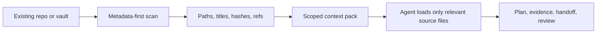
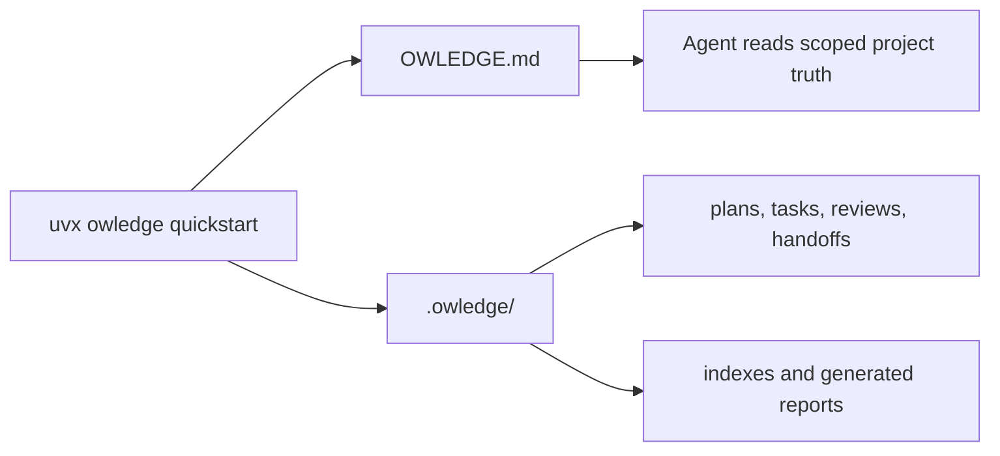
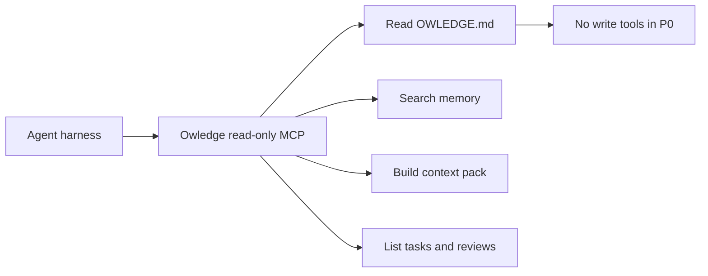
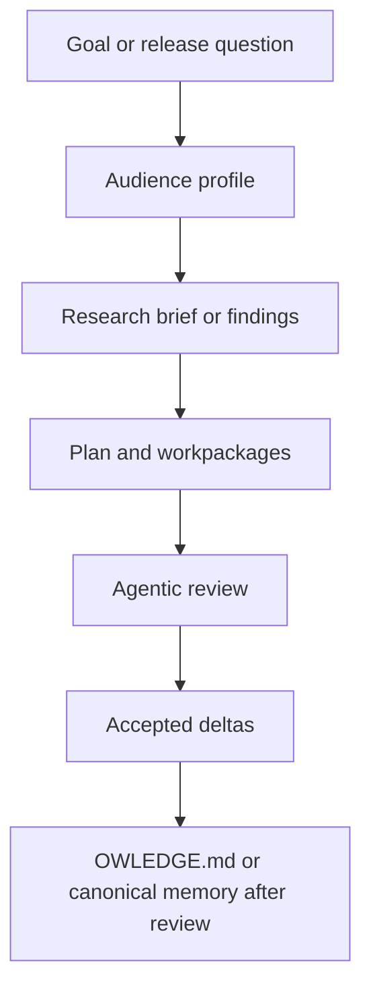
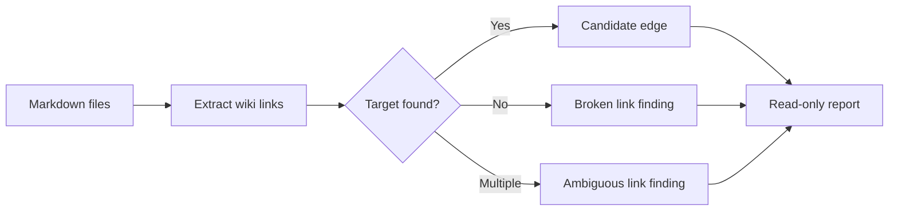
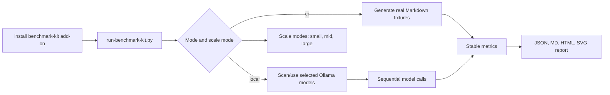
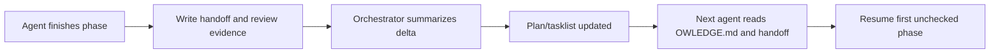

# Owledge

**Drop-in durable project memory for existing Markdown repos and Obsidian-style vaults: no migration, no vector DB, no wiki-link rewrite.**

[](VERSION)
[](LICENSE)
[](docs/quickstart.md)
[](docs/harness-plugin-matrix.md)
[](https://github.com/elmokirk/owledge/actions/workflows/ci.yml)
[](https://github.com/elmokirk/owledge/actions/workflows/docs.yml)

Owledge gives agents durable local Markdown artifacts: plans, evidence, reviews, handoffs, and decisions that stay readable across sessions, tools, teams, and existing vaults.

Use it when agents are losing project context, plans are stuck in chat, multiple runtimes need a shared handoff surface, or a mature knowledgebase needs traceable decisions without a migration.

Core idea: **Markdown is the source of truth; indexes, reports, graphs, benchmarks, and runtime adapters are generated or optional views.**

**Release proof:** local release gates pass with additive writes by default, private runtime capture, metadata-first KB scan, and no required OS-wide setup. CI runs platform-neutral Python gates; broader runtime installs remain local adapter support, not marketplace certification.

**Minimal by default:** start with principles and skills only. Add project files,
runtime adapters, or add-ons only when the current project needs durable local
artifacts, runtime capture, proof assets, or release evidence.

## Repo Layout

This repository ships product source from `templates/owledge/`. The
`internal/owledge/` directory is the maintainers' dogfood workspace
(generated artifacts, not shipped). The `tools/` directory holds the Python
CLI. See [docs/distribution.md](docs/distribution.md) for the full
Dogfooding vs. Product breakdown.

## Table Of Contents

- [Why It Exists](#why-it-exists)
- [Problem To Solution](#problem-to-solution)
- [Install Or Try](#install-or-try)
- [Quickstart Paths](#quickstart-paths)
- [Decision Guide](#decision-guide)
- [Before / After](#before--after)
- [Harness Support](#harness-support)
- [Integration Model](#integration-model)
- [Performance And Token Model](#performance-and-token-model)
- [Core Workflows](#core-workflows)
- [Standalone Skills](#standalone-skills)
- [Troubleshooting](#troubleshooting)
- [Not This](#not-this)
- [Launch Extensions](#launch-extensions)
- [Quality Gates](#quality-gates)
- [Documentation](#documentation)

## Why It Exists

Owledge is for teams and power users who already work in Markdown, Obsidian, LLM wikis, or agent-driven coding repos and need project context to survive beyond one chat session.

- Keep context durable instead of rebuilding it from transcript history.
- Keep MVP plans grounded with evidence, cutlines, reviews, and handoffs.
- Fit existing knowledgebases without rewriting wiki links or note structure.
- Let multiple agents coordinate through explicit artifacts instead of raw logs.
- Stay local, inspectable, and repo-friendly.

## Problem To Solution

| Problem | Owledge solution |
| --- | --- |
| Agents forget context between sessions | `OWLEDGE.md` plus `.owledge/` creates a durable project entrypoint and memory layer. |
| Plans live only in chat | `.owledge/plans/`, `.owledge/tasks/`, and `.owledge/workpackages/` keep scoped work visible and reviewable. |
| Handoffs are vague | `.owledge/handoffs/` and context packs give the next agent explicit source files, decisions, and next actions. |
| Docs and implementation drift | `doctor`, `test-contracts`, `public-docs`, `release-trust`, and finalization gates catch stale public claims. |
| Obsidian links are fragile | `owledge wikilink-audit` checks valid, broken, and ambiguous wiki links without rewriting notes. |
| Users doubt token efficiency | Optional `benchmark-kit` add-on emits real Markdown fixture reports with token usage, performance, context pollution, retrieval, safety, and speed metrics. |
| Users want one skill without the full kit | `standalone-skills/` provides independently installable Owledge skills for blindspot audit, agentic review, brainstorm, and planning layer use. |
| Teams need review and research traceability | `.owledge/reviews/`, `.owledge/audiences/`, and `.owledge/research/` make red-team, audience, and research artifacts first-class. |

## Install Or Try

Owledge is uv-first for agents and harnesses:

```bash
uvx owledge --help
uvx owledge quickstart --target .agent-control/tmp/owledge-five-minute-demo
```

For repeated use:

```bash
uv tool install owledge
owledge doctor --project-root .
owledge doctor --project-root /path/to/your-project
```

Source checkout remains useful for contributors:

```bash
python tools/owledge.py --help
```

Fastest proof path:

```bash
uvx owledge quickstart --target .agent-control/tmp/owledge-five-minute-demo
owledge install-addon --project-root .agent-control/tmp/owledge-five-minute-demo --addon launch-demo-kit
owledge doctor --project-root .agent-control/tmp/owledge-five-minute-demo
```

Expected result: the demo project contains evidence, a next-agent handoff, and
a static proof report. Full walk-through: [Try Owledge in 5 minutes](docs/try-owledge-in-5-minutes.md).

Benchmark proof:

On the v0.7.0 synthetic Markdown fixture, Owledge reduced context pollution by
88.36% on average and reduced tokens per correct answer by 83.54% on average
against the naive baseline. Real-world savings vary by vault shape, model,
runtime, and retrieval configuration.

- [v0.7.0 benchmark summary](benchmarks/v0.7.0/README.md)
- [HTML comparison report](benchmarks/v0.7.0/results/comparison/index.html)
- [Methodology](benchmarks/v0.7.0/methodology.md)
- [Injected benchmark traps](benchmarks/v0.7.0/benchmark-explained.md)

The published runs use deterministic test vaults, not a personal vault. The
privacy-trap baseline is expected to fail; the product proof is whether the
Owledge context-pack profile keeps private and stale notes out.

## Quickstart Paths

### 0. Use Only The Principles Or Skills

For the smallest setup, do not install anything. Tell an agent to follow the
Owledge principles or use `skills/owledge-principles`:

```text
Follow Owledge principles: keep Markdown canonical, preserve existing files,
write evidence-linked plans and handoffs, use stable frontmatter ids and typed
edges, keep raw sessions private, and promote only reviewed memory.
```

This path is the default for existing systems, solo users, and quick adoption.

### 1. Add Owledge To A Project

Package path:

```bash
uvx owledge quickstart --target /path/to/your-project
```

Source checkout path:

```bash
python tools/owledge.py init-project --target /path/to/your-project
```

This is the primary setup path. It adds project-local Markdown memory and
Python tools without changing the host framework, package manager, or source
tree.

Best next read: [Project quickstart](docs/quickstart.md)

### 2. Add Owledge To A Knowledgebase

Add Owledge as a small additive module inside an existing vault:

```bash
python tools/owledge.py add-kb-module --knowledgebase-root /path/to/your/vault
```

Best next read: [Drop-in agent integration guide](docs/agent-integration-guide.md)

### 3. Check An Existing Install

Verify any initialized project:

```bash
python tools/owledge.py doctor --project-root /path/to/your-project
```

### Optional: Plugin / Harness Setup

Use the ready-to-install Cowork / Claude-compatible plugin bundle:

```text
plugins/owledge-cowork/
```

Best next read: [Plugin install guide](docs/install-plugin.md)

### Optional: Project Snapshot Kit

Install the optional project cockpit add-on only when a project should generate
reusable snapshots and static HTML pages:

```bash
python tools/owledge.py install-addon --project-root . --addon project-snapshot-kit
python tools/owledge.py project-snapshot --project-root .
```

The generation command asks before creating Markdown snapshots or HTML pages
unless explicit non-interactive flags are used.

### Optional: Launch Add-ons

Launch add-ons improve distribution readiness without changing the core memory
contract:

```bash
python tools/owledge.py install-addon --project-root . --addon launch-demo-kit
python tools/owledge.py install-addon --project-root . --addon trust-readiness-kit
python tools/owledge.py install-addon --project-root . --addon runtime-conformance-kit
python tools/owledge.py install-addon --project-root . --addon pi-proof-kit
```

Additional proof add-ons are available for teams that need TypeScript CI
validation, benchmark charts, decision traceability, cross-project reuse,
multi-agent handoffs, or poweruser positioning:

```bash
python tools/owledge.py install-addon --project-root . --addon ts-adapter-kit
python tools/owledge.py install-addon --project-root . --addon benchmark-kit
python tools/owledge.py install-addon --project-root . --addon decision-trace-kit
python tools/owledge.py install-addon --project-root . --addon cross-project-hub-kit
python tools/owledge.py install-addon --project-root . --addon swarm-coordination-kit
python tools/owledge.py install-addon --project-root . --addon poweruser-positioning-kit
```

## Decision Guide

Use the smallest integration that solves the current problem.

| Path | Use when | Adds |
| --- | --- | --- |
| Principles-only / Skills | An agent needs the memory rules inside an existing workflow | Instructions only |
| Project-local kit | A repo needs durable plans, evidence, handoffs, indexes, and validation | Local Markdown memory and Python tools |
| Knowledgebase module | An existing Markdown or Obsidian-style vault should be scanned without migration | Additive module or mapped indexes |
| Runtime adapter | Session capture, hooks, or runtime handoffs are needed | Optional plugin files and hooks |
| Planning layer skill | A project already has its own `AGENTS.md` or agent memory and should keep it | Opt-in Owledge planning, evidence, handoff, and context hygiene rules |
| Add-ons | Demo, trust, conformance, PI proof, TS eval, benchmark, decision trace, cross-project hub, swarm coordination, or positioning evidence is needed | Optional docs, fixtures, tools, and generated views |

Detailed guide: [Integration decision guide](docs/integration-decision-guide.md).

## Before / After

Without Owledge:

- a plan lives in chat
- evidence is scattered across notes and commits
- a second agent has to reconstruct the project state
- handoffs depend on whoever remembers the context

With Owledge:

- plans live in Markdown
- evidence paths are explicit
- handoffs and reviews are durable artifacts
- future agents can resume from scoped files instead of entire chat logs

## Harness Support

Owledge is a memory layer around agent runtimes. It does not replace the runtime or its execution methodology.

| Harness | Current shape | Install path |
| --- | --- | --- |
| Principles-only coding agents | First-class support | Instructions or `owledge-principles` skill |
| Codex | Local adapter support | Local CLI, skills, optional plugin adapter |
| Claude Code | Local adapter support | Skill/plugin copy path plus project-local memory rules |
| Cowork / Claude-compatible | Local adapter support | `plugins/owledge-cowork/` |
| OpenCode-style agents | Instruction-based support | Repo-link integration via `AGENTS.md` and local scripts |
| Existing Markdown / Obsidian KBs | Primary supported path | `tools/build_kb_module.py`, `owledge-map.json`, and `wikilink-audit` |
| PI agents | Advanced optional path | Candidate-only QA, workspace checks, and intelligence artifacts |

Full matrix: [Harness and plugin matrix](docs/harness-plugin-matrix.md)

## Integration Model

| Mode | What changes | Best fit |
| --- | --- | --- |
| Principles-only | Agent instructions adopt the Owledge memory contract without adding a plugin; no plugin, generator, wrapper, or OS-specific setup is required | Existing coding agents and mature repos |
| Project-local kit | Adds `OWLEDGE.md`, `.owledge/`, local Python tools, and optional runtime adapter files | Coding projects that want durable memory in-repo |
| Knowledgebase module | Adds an Owledge-owned module or mapped folders beside an existing Markdown KB | Obsidian-style vaults and LLM wikis |
| Runtime adapter | Adds optional plugin hooks and commands around the same Markdown source of truth | Claude/Cowork/Codex-compatible local workflows |

## Performance And Token Model

Owledge is designed to avoid the "load the whole vault into context" failure mode.



| Area | Current release behavior |
| --- | --- |
| KB scan | Metadata-first by default; no body-copy migration |
| Token strategy | Paths and refs first, full bodies only on demand |
| Write policy | Additive module or mapped writes; existing notes unchanged by default |
| Scale guard | `--max-files`, excluded generated dirs, truncation reporting |
| Benchmarks | Optional `benchmark-kit` add-on with real Markdown fixtures, deterministic CI mode, opt-in sequential Ollama local mode, and multi-model comparison reports |

Benchmarks and scale notes: [Performance and scale notes](docs/performance-scale-notes.md)

## Core Workflows

### Project Setup



### Read-Only MCP

Owledge ships a read-only MCP surface in v0.7.0.



### Planning, Review, Research



### Wikilink Audit



### Benchmark Kit



## Standalone Skills

Owledge also ships selected skills as separate, download-friendly folders under
`standalone-skills/`. Use this when a user wants a single workflow without
installing the full project memory kit.

| Skill | Use |
| --- | --- |
| `owledge-blindspot-audit` | Stress-test a concept, repo, plan, or launch surface for hidden gaps. |
| `owledge-agentic-review` | Run evidence-linked red-team and expert review workflows. |
| `owledge-brainstorm` | Generate candidate options without mutating canonical memory. |
| `owledge-planning-layer` | Apply Owledge planning, handoff, and QA rules in an existing agent setup. |

See [standalone-skills/README.md](standalone-skills/README.md).

### Handoff And Resume



## Troubleshooting

| Symptom | Check |
| --- | --- |
| `owledge` command not found | Run `uvx owledge --help` or `uv tool install owledge`. |
| Fresh project has old `OWLEDGE.md`/`.owledge/` | Re-run `owledge quickstart --target <path>` with v0.7.0 and check for `OWLEDGE.md` plus `.owledge/`. |
| Wikilink audit fails | Run `owledge wikilink-audit --project-root .` and fix unresolved or ambiguous targets. Code blocks and inline code are ignored. |
| Local benchmark refuses to run | Install `benchmark-kit`, then pass explicit scale mode, model, and consent: `python tools/benchmark-kit/run-benchmark-kit.py --mode local --scale-mode small --models gemma4:latest --yes`. |
| MCP integration should not write | Use `tools/owledge_mcp.py`; v0.7.0 P0 exposes read-only tools only. |
| Docs look stale after code changes | Run `owledge test public-docs`, `owledge test release-trust`, and `owledge wikilink-audit --check`. |

## Not This

Owledge is not:

- a hosted platform
- a vector database
- an RBAC or enterprise policy system
- a replacement for Superpowers or Ponytail
- a requirement to migrate your existing vault taxonomy

It is a local/project utility layer for durable memory, planning discipline, and agent coordination.

## Launch Extensions

The core stays small. Broad-launch proof is handled by optional add-ons:

| Add-on | Purpose |
| --- | --- |
| `launch-demo-kit` | Five-minute demo with evidence, handoff, and static proof report. |
| `trust-readiness-kit` | Data-flow, threat model, security FAQ, and team checklist. |
| `runtime-conformance-kit` | Read-only runtime contracts for Codex, Claude Code, and Cowork-compatible adapters. |
| `pi-proof-kit` | Synthetic PI loop proving observe, detect, red-team, promote, and measure. |
| `ts-adapter-kit` | Optional Node/TypeScript CI validation for the Markdown contract. |
| `benchmark-kit` | Optional real Markdown fixture benchmark with token, performance, context pollution, single-run reports, and multi-model comparison proof reports. |
| `decision-trace-kit` | Read-only JSON and HTML trace from memory records to decision tree. |
| `cross-project-hub-kit` | Reviewed export map from project-local lessons, patterns, decisions, and summaries into a central reusable hub. |
| `swarm-coordination-kit` | Role-lane templates for Codex, Claude Code, Hermes, and generic agent swarms without hard distributed locking. |
| `poweruser-positioning-kit` | Snapshot-first positioning scorecard for adjacent AI-agent tool categories. |

Launch scoring and pass/fail criteria: [Launch readiness rubric](docs/launch-readiness.md). Distribution path: [Distribution and release](docs/distribution.md).

## Quality Gates

Release validation is scriptable and local:

```bash
python tools/owledge.py finalization-gates --project-root . --include-compliance
python tools/owledge.py redteam-qa --project-root .
```

Public docs are checked separately for encoding, anchors, links, plugin/install consistency, and benchmark asset presence:

```bash
python tools/owledge.py test public-docs --project-root .
python tools/owledge.py test quality-ratchet --project-root .
python tools/owledge.py test launch-readiness --project-root .
```

## Release QA

Release QA is contract-backed: contracts/release-surface.json declares every
current version sink, public documentation file, and product feature's required
documentation and verification. Run the docs-contract against origin/main for a
product PR and the release-contract with require-dist before publishing a
release branch.

## Documentation

Start here: [Documentation index](docs/README.md)

- [Quickstart](docs/quickstart.md)
- [Integration decision guide](docs/integration-decision-guide.md)
- [Try Owledge in 5 minutes](docs/try-owledge-in-5-minutes.md)
- [Launch readiness rubric](docs/launch-readiness.md)
- [Distribution and release](docs/distribution.md)
- [Drop-in agent integration guide](docs/agent-integration-guide.md)
- [Plugin install guide](docs/install-plugin.md)
- [Harness and plugin matrix](docs/harness-plugin-matrix.md)
- [MVP plan example](docs/mvp-plan-example.md)
- [Demo vault](examples/README.md)
- [Performance and scale notes](docs/performance-scale-notes.md)
- [Benchmark Kit](docs/benchmark-kit.md)
- [Team and long-running project guide](docs/team-long-running-project-guide.md)
- [Command reference](docs/command-reference.md)
- [Project Snapshot Kit](docs/project-snapshot-kit.md)
- [Decision Trace Kit](docs/decision-trace-kit.md)
- [Benchmark Kit](docs/benchmark-kit.md)
- [Cross-Project Hub Kit](docs/cross-project-hub-kit.md)
- [Swarm Coordination Kit](docs/swarm-coordination-kit.md)
- [Poweruser Positioning Kit](docs/poweruser-positioning-kit.md)
- [Standalone Skills](standalone-skills/README.md)
- [Owledge vs agent methods](docs/owledge-vs-agent-methods.md)
