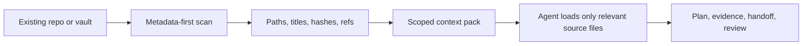

# Owledge

**A Markdown-first persistent memory and project-planning layer for AI agents, existing knowledgebases, and multi-agent delivery workflows.**

[](VERSION)
[](LICENSE)
[](docs/quickstart.md)
[](docs/harness-plugin-matrix.md)
[](docs/README.md)

Owledge gives agents durable project memory in local Markdown: plans, evidence, reviews, handoffs, and decisions that stay readable across sessions, tools, teams, and existing vaults.

> Use Superpowers to execute. Use Owledge to remember, hand off, review, and keep project knowledge durable.  
> Use Ponytail to reduce code. Use Owledge to preserve context, evidence, and planning discipline.

**Release proof:** 20 release gates passing locally, additive writes by default, private runtime capture, metadata-first KB scan, and no required OS-wide setup.

## Table Of Contents

- [Why It Exists](#why-it-exists)
- [Quickstart Paths](#quickstart-paths)
- [Before / After](#before--after)
- [Harness Support](#harness-support)
- [Performance And Token Model](#performance-and-token-model)
- [Not This](#not-this)
- [Quality Gates](#quality-gates)
- [Documentation](#documentation)

## Why It Exists

Owledge is for teams and power users who already work in Markdown, Obsidian, LLM wikis, or agent-driven coding repos and need project context to survive beyond one chat session.

- Keep context durable instead of rebuilding it from transcript history.
- Keep MVP plans grounded with evidence, cutlines, reviews, and handoffs.
- Fit existing knowledgebases without rewriting wiki links or note structure.
- Let multiple agents coordinate through explicit artifacts instead of raw logs.
- Stay local, inspectable, and repo-friendly.

## Quickstart Paths

### 1. Existing Markdown Knowledgebase

Add Owledge as a small additive module inside an existing vault:

```bash
python tools/build_kb_module.py --knowledgebase-root /path/to/your/vault --include-cli
```

Windows:

```powershell
py -3 tools\build_kb_module.py --knowledgebase-root C:\path\to\your\vault --include-cli
```

Best next read: [Drop-in agent integration guide](docs/agent-integration-guide.md)

### 2. Existing Coding Project

Bootstrap a host project from your local Owledge clone:

```powershell
powershell -NoProfile -ExecutionPolicy Bypass -File .\tools\bootstrap-agent-memory.ps1 -ProjectRoot C:\path\to\your-project -KitRoot .
```

Best next read: [Project quickstart](docs/quickstart.md)

### 3. Plugin / Harness Setup

Use the ready-to-install Cowork / Claude-compatible plugin bundle:

```text
plugins/agent-memory-cowork/
```

Best next read: [Plugin install guide](docs/install-plugin.md)

## Before / After

Without Owledge:

- a plan lives in chat
- evidence is scattered across notes and commits
- a second agent has to reconstruct the project state
- handoffs depend on whoever remembers the context

With Owledge:

- plans live in Markdown
- evidence paths are explicit
- handoffs and reviews are durable artifacts
- future agents can resume from scoped files instead of entire chat logs

## Harness Support

Owledge is a memory layer around agent runtimes. It does not replace the runtime or its execution methodology.

| Harness | Current shape | Install path |
| --- | --- | --- |
| Codex | Ready | Local CLI, skills, optional plugin adapter |
| Claude Code | Ready | Skill/plugin copy path plus project-local memory rules |
| Cowork / Claude-compatible | Ready | `plugins/agent-memory-cowork/` |
| OpenCode-style agents | Ready | Repo-link integration via `AGENTS.md` and local scripts |
| Existing Markdown / Obsidian KBs | Ready | `tools/build_kb_module.py` or `agent-memory-map.json` |
| PI agents | Optional | Candidate-only QA, workspace checks, and intelligence artifacts |

Full matrix: [Harness and plugin matrix](docs/harness-plugin-matrix.md)

## Performance And Token Model

Owledge is designed to avoid the "load the whole vault into context" failure mode.



| Area | Current release behavior |
| --- | --- |
| KB scan | Metadata-first by default; no body-copy migration |
| Token strategy | Paths and refs first, full bodies only on demand |
| Write policy | Additive module or mapped writes; existing notes unchanged by default |
| Scale guard | `--max-files`, excluded generated dirs, truncation reporting |
| Benchmarks | Reproducible local harness included under `benchmarks/` |

Benchmarks and scale notes: [Performance and scale notes](docs/performance-scale-notes.md)

## Not This

Owledge is not:

- a hosted platform
- a vector database
- an RBAC or enterprise policy system
- a replacement for Superpowers or Ponytail
- a requirement to migrate your existing vault taxonomy

It is a local/project utility layer for durable memory, planning discipline, and agent coordination.

## Quality Gates

Release validation is scriptable and local:

```powershell
powershell -NoProfile -ExecutionPolicy Bypass -File .\tools\run-finalization-gates.ps1 -ProjectRoot . -IncludeCompliance
powershell -NoProfile -ExecutionPolicy Bypass -File .\tools\run-redteam-qa.ps1 -ProjectRoot .
```

Public docs are checked separately for encoding, anchors, links, plugin/install consistency, and benchmark asset presence:

```powershell
powershell -NoProfile -ExecutionPolicy Bypass -File .\tools\test-public-docs.ps1 -ProjectRoot .
```

## Documentation

Start here: [Documentation index](docs/README.md)

- [Quickstart](docs/quickstart.md)
- [Drop-in agent integration guide](docs/agent-integration-guide.md)
- [Plugin install guide](docs/install-plugin.md)
- [Harness and plugin matrix](docs/harness-plugin-matrix.md)
- [MVP plan example](docs/mvp-plan-example.md)
- [Performance and scale notes](docs/performance-scale-notes.md)
- [Team and long-running project guide](docs/team-long-running-project-guide.md)
- [Command reference](docs/command-reference.md)
- [Owledge vs agent methods](docs/owledge-vs-agent-methods.md)
