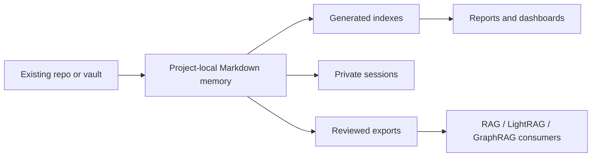

# Owledge Data Flow

## Artifact Classes

| Class | Examples | Sharing rule |
| --- | --- | --- |
| Canonical project memory | `PROJECT_CONTEXT.md`, `agent-memory/canonical/` | Share only by repo policy. |
| Private runtime memory | `agent-memory/sessions/` | Never shared by default. |
| Evidence and handoffs | `agent-memory/evidence/`, `agent-memory/handoffs/` | Review before reuse. |
| Generated views | indexes, reports, exports | Rebuildable; not canonical. |
| Shared export | reviewed RAG documents | Requires approved review and sanitization. |

## Deletion And Retention

Owledge provides read-only checks for stale, private, and sensitive records. The
repository owner remains responsible for deletion, retention, backup, and legal
hold policy.

