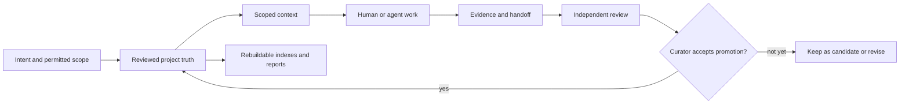

# How Owledge works

Owledge turns a bounded piece of work into a project record that a person and
the next agent can inspect, challenge, and continue. It is deliberately a
local, Markdown-first layer: it does not need a hosted account, a vector
database, or a background worker to be useful.

## The lifecycle

The same flow in words: a person defines the intent and permitted scope;
reviewed project Markdown supplies the truth; a deliberately small context pack
is assembled for work; the worker leaves evidence and a handoff; an independent
review checks the result; and a human curator may promote an accepted result.
Indexes, reports, graphs, and context packs are derived views that can be
rebuilt from the reviewed record.

The important distinction is that **a file existing is not promotion**. Agent
output, a hook capture, a PI suggestion, or a generated report is a candidate
until a responsible reviewer accepts it into project truth.

## What each layer means

| Layer | Typical location or artifact | Authority | Handling |
| --- | --- | --- | --- |
| Canonical project truth | `OWLEDGE.md`, reviewed decisions, plans, and accepted evidence | Source of truth for the project | Human-readable Markdown; changes are reviewable in Git |
| Candidate material | Unreviewed agent output, PI suggestions, review proposals | Not authoritative | Keep separate until a curator accepts or rejects it |
| Generated views | Indexes, reports, graphs, compiled snapshots, context packs | Rebuildable convenience | Regenerate from canonical records; never let them override reviewed truth |
| Private material | Raw session capture and private user context | Private, not shared project truth | Keep out of shared retrieval and promotion by default |
| Shared material | Reviewed and sanitized decisions, evidence, and handoffs | Project-local truth once accepted | Share only after the required review and sanitization |

## Who can do what

This matrix is intentionally explicit: it prevents an agent from mistaking a
discovery mechanism or a generated file for an authorization to change project
truth.

| Action | Actor | Trigger | Default | Side effect | Authority | Recovery |
| --- | --- | --- | --- | --- | --- | --- |
| Read project instructions | Agent or harness | Session start or explicit task | Read-only | Provides local rules and context | Instructions guide the worker; they do not promote records | Re-read the project instructions and correct the work |
| Discover an Owledge skill | Configured harness or agent | Harness-specific discovery or explicit invocation | No automatic discovery guarantee | Makes a skill available to the worker | The harness decides what it can discover; `.owledge/skills` alone is not a universal runtime registry | Install or bridge the skill in the harness-supported global/project skill location |
| Run an optional hook | Configured local hook | A matching local event | Off unless installed | May capture local session metadata or run a local check | Hooks do not grant promotion authority | Disable or uninstall the hook; review any captured candidate material |
| Use a skill | Human, agent, or harness | Explicit task intent and supported invocation | On-demand | Produces advice or scoped work | Skill output remains candidate material unless reviewed | Re-run with smaller scope or reject the output |
| Run a CLI command | Human or agent | Direct command invocation | On-demand and local | Creates only the command's documented local artifacts | The command does not automatically approve its output | Inspect artifacts, rerun with corrected inputs, or remove only the documented generated output |
| Read through MCP | MCP client | Explicit client tool call | Read-only P0 profile | Returns project information to the client | `tools/owledge_mcp.py` has no write-enabled promotion tools | Stop the client call; use the normal reviewed Markdown workflow for changes |
| Curate a proposal | Responsible human reviewer | Review of evidence and scope | Manual decision | Accepts, revises, rejects, or defers a candidate | Only the designated curator can promote a candidate into canonical truth | Keep the candidate unpromoted, request revision, or record a rejection |
| Synchronize between machines or teams | Project owner | Explicit future integration | No hosted remote synchronization in v0.7.1 | None by default | A future Team Hub/sync capability is post-v1, not a current authority path | Use normal Git or approved project sharing practices today |
| Run background automation | Scheduler or service | Scheduled event | No autonomous background scheduler | None by default | No scheduler has implicit authority | Keep work on explicit human/agent invocation |

## A practical daily loop

1. State the smallest shippable outcome and its boundaries.
2. Read the relevant reviewed plan and records, then build only the context
   needed for that task (for example with `python tools/owledge.py
   build-context-pack --help`).
3. Work in the permitted paths; record the test evidence and a concise handoff.
4. Have an independent reviewer inspect the result when the ticket or release
   gate requires it.
5. Let the responsible person accept, revise, reject, or defer the proposed
   promotion. Rebuild generated views only after the reviewed truth is current.

This works for a small one-person task, an existing repository, a standalone
Markdown vault, or explicit multi-agent lanes. Multi-agent work adds handoffs
and review boundaries; it does not turn independent agents into automatic
curators.

## Start from the right entry point

- For installation choices, use the [Installation Hub](install/README.md).
- For commands and their exact boundaries, use the [command reference](command-reference.md).
- For agent setup, use the [agent integration guide](agent-integration-guide.md).
- For harness and MCP capability boundaries, use the [harness/plugin matrix](harness-plugin-matrix.md).
- For the product category and public maturity labels, return to [What is Owledge?](what-is-owledge.md).

The local HTTP adapter is separately documented as
[local experimental](security/local-http-control-plane.md); it is not a hosted
control plane or a remote multi-tenant authorization service.
