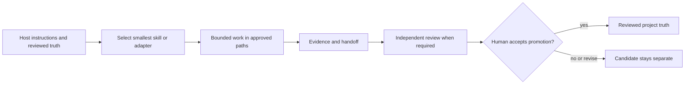

# Skills and agent integrations

Owledge separates portable operating rules from optional runtime adapters. Pick
the smallest path that makes the current task safe and repeatable. A skill
guides a worker; it does not grant permission to mutate canonical truth.

## Start with the right path

| Situation | Start here | Why |
| --- | --- | --- |
| Existing system, no Owledge tooling needed | [`owledge-contract`](../standalone-skills/owledge-contract/SKILL.md) | Runtime-independent default; no CLI, hook, MCP, or kit is required. |
| Existing Markdown KB or project | [`owledge-principles`](../skills/owledge-principles/SKILL.md) | Additive policy that preserves the current structure. |
| MVP cutline, version reflection, ticket, gate, or recovery | [`owledge-long-horizon-delivery`](../skills/owledge-long-horizon-delivery/SKILL.md) | Bounded delivery modes. |
| Existing host has its own planning process | [`owledge-planning-layer`](../skills/owledge-planning-layer/SKILL.md) | Compatibility facade for the same MVP-first rules. |
| Local commands, skills, and durable files are needed | [Project installation](install/project.md) | Initializes the project-local kit and discovery mirrors. |
| Optional local event capture is needed | [Plugin installation](install-plugin.md) | Local adapter; hook output remains private candidate material. |

## Public skill registry

| Skill or integration | Class | Trigger | Inputs | Effects | Dependencies | Runtime support | Stability |
| --- | --- | --- | --- | --- | --- | --- | --- |
| `owledge-contract` | Principles-only policy/workflow | Persistent plan/checklist without Owledge tooling | Host instructions, plans, decisions, evidence | Writes only to host-approved planning locations when asked | None | Any instruction-following agent | Available, standalone |
| `owledge-principles` | Policy skill | Existing KB, additive integration, durable handoff | Existing records and optional map | Additive Owledge artifacts only | None | Generic agents and local kits | Available |
| `owledge-long-horizon-delivery` | Workflow skill | MVP cutline, version, ticket, gate, recovery | Host instructions, run state, scoped records | Smallest mode-specific plan, evidence, or handoff | Project records when present | Codex mirror and declared plugin roots; manual elsewhere | Available |
| `owledge-planning-layer` | Workflow compatibility facade | Existing planning system needs bounded Owledge planning | Host rules and ideas/roadmap | Routes extra ideas; never replaces host rules | Long-horizon skill when available | Codex mirror and declared plugin roots; manual elsewhere | Available |
| `owledge-brainstorm` | Candidate workflow | Explicit bounded strategy exploration | Scoped project evidence | Candidate options, never automatic decisions | None | Codex mirror and declared plugin roots; manual elsewhere | Available |
| `owledge-autonomous-delivery` | Consent-first delivery policy | User explicitly asks for delegation | Ticket, risk, dependencies, approved scope | Proposes lanes; never dispatches itself | Explicit user approval | Codex mirror and declared plugin roots | Available, consent-gated |
| `owledge-runtime-bridge` | Runtime adapter guidance | Compact context, evidence, or handoff | Project Markdown and adapter capability | Guides bounded local artifact handling | Local kit for CLI use | Generic/Codex/Claude-compatible profiles | Available |
| `review-evaluation-workflow` | Review workflow | Red team, QA, scorecard, promotion readiness | Subject and evidence | Review evidence and follow-up tasks | Review templates; optional local command | Codex mirror and declared plugin roots | Available |
| `concept-blindspot-audit` | Conceptual red-team workflow | Kit foundations, distribution, or lifecycle need challenge | Scoped kit records and audit profile | Candidate findings and bounded feedback proposals | Concept-audit command for deterministic dimensions | Codex mirror; manual invocation elsewhere | Available, candidate-only |
| `render-memory-report` | Generated-view workflow | A visual decision, handoff, or stakeholder report is requested | Reviewed Markdown/JSONL and optional design rules | Local HTML report linked to sources | Local report tooling; optional add-on for some report types | Codex mirror; manual invocation elsewhere | Available, generated output |
| `tools/owledge_mcp.py` | Read-only MCP adapter | Explicit MCP client call | Project path and query/tool input | Reads entrypoint, doctor, search, context, tasks, reviews | Python standard library/local project data | MCP-compatible clients | Read-only P0; no write path |
| `plugins/owledge-cowork/` | Optional local runtime adapter | User installs declared plugin | Runtime events and local project root | Private captures and draft summaries | Explicit plugin installation | Claude/Cowork-compatible plugin roots | Local adapter support |

## Discovery and precedence

Use this order when rules conflict or when deciding whether a component can act:

1. The user request and host `AGENTS.md` / `CLAUDE.md` define permitted work and authority.
2. Reviewed project truth (`OWLEDGE.md`, accepted plans, decisions, evidence, active run state) defines current facts.
3. The selected skill supplies a workflow only within those boundaries.
4. An installed hook may capture local events; it cannot approve, promote, or expand scope.
5. A directly invoked CLI performs only its documented local action.
6. The MCP profile is read-only: agents must not infer a write, promotion, or remote sync path from MCP availability.

For Codex host projects, `init-project` materializes matching skills under
`.agents/skills/`. The root `skills/` tree is the Owledge source/vendor bundle;
plugin-capable runtimes use the plugin's declared `skills/` root.
`.owledge/skills/` is **not** an automatic discovery root. A missing mirror can
be materialized by the documented initializer or safe upgrade. A drifting mirror
is intentionally treated as user-edited: run `doctor`, compare it with the root
skill, and have the project owner explicitly choose whether to preserve it or
restore it. `upgrade --mode force-templates --apply --yes` can overwrite edited
files and is therefore a reviewed, explicit recovery action - not an automatic
repair path.

## Invocation and reviewed promotion



In prose: host instructions and reviewed project truth constrain the selected
skill; the skill guides bounded work in approved paths; the worker records
evidence and a handoff; independent review happens where required; a
responsible owner's recorded approval accepts promotion in the workflow. The
local CLI does not authenticate that its caller is a human or owner. A rejected
or revised proposal remains candidate material and never becomes truth merely
because a skill, hook, CLI, or MCP client produced it.

## Verified host workflow

From an Owledge source checkout, replace `<project>` with a new or existing host:

```bash
python tools/owledge.py init-project --target <project>
python tools/owledge.py doctor --project-root <project> --mode host
```

The host proof must show the same bytes in `skills/<name>/` and
`.agents/skills/<name>/` for every shipped host skill. A maintainer checkout is
not host proof because it intentionally keeps source skills outside a consumer
project's discovery root. For the optional Claude/Cowork adapter, follow the
[plugin guide](install-plugin.md) and its runtime-adapter smoke. Hooks are
optional, local, and fail-soft; inspect `.agent-control/logs/plugin-errors.jsonl`
when they report an error. Raw hook captures are never shared context or
canonical truth.

## Agent execution contract

Before work, read host instructions, `OWLEDGE.md` when present, the active plan,
and the smallest relevant evidence/handoff. Select the smallest applicable path,
state allowed writes and a stop condition, and use a scoped context pack rather
than a whole vault or raw session history.

During work, write only to approved paths and report changed files, commands,
results, limitations, and the exact next action. Stop for direction when new
authority is needed, the MVP cutline changes, a write-enabled MCP/remote service
is required, or reviewed project truth conflicts. Review and promotion remain
separate owner-controlled workflow steps. The local CLI records review/status
preconditions but does not authenticate that its caller is a human or owner;
teams must record owner approval in their reviewed workflow before promotion.

## Happy path and variants

1. Use `owledge-contract` for principles-only work, or initialize a kit when local validation and handoffs are needed.
2. Use `owledge-long-horizon-delivery` in `mvp-sparring` for a broad request; route valuable non-MVP ideas to the roadmap.
3. Execute one bounded ticket, capture evidence, and request independent QA where the ticket requires it.
4. Use `version-steering` after a version gate and stop for the owner's `approve`, `adjust`, or `defer` decision.

For a small task, use the principles-only path and a concise handoff. For
multi-agent work, use non-overlapping path claims and independent review. For a
Markdown KB, use the additive KB module rather than rewriting notes. Advanced
runtime plugins and MCP remain optional adapters and do not change the Markdown
or promotion model.

### Agent-choice scenarios

| Scenario | Correct first path | Host proof | Deliberate non-choice |
| --- | --- | --- | --- |
| A user wants an MVP plan in an existing repository without installing anything | `owledge-contract` | Persist the host-approved plan and checklist, then hand off | Do not require a CLI, plugin, MCP, or vector database |
| A user wants an initialized Codex project | `init-project`, then `.agents/skills/owledge-long-horizon-delivery` | `doctor --mode host` reports matching discovery mirrors | Do not claim root `skills/` or `.owledge/skills/` is auto-discovered |
| A user wants an existing Markdown vault preserved | `owledge-principles`, then the additive KB module when requested | Existing notes remain unchanged; module/mapped writes are bounded | Do not rewrite wiki links or make the vault a runtime service |
| A user asks for parallel delivery | `owledge-autonomous-delivery` | User approves a bounded lane plan before dispatch | Do not treat a skill trigger as authorization to spawn agents |
| An MCP client needs context | `tools/owledge_mcp.py` | Read-only MCP smoke lists no write-like tools | Do not infer write, promotion, or remote sync capability |

## Recovery

If discovery or execution is uncertain, do not guess. Re-read host instructions
and the active handoff, run `doctor`, verify the active phase's QA command, and
resume from the first unchecked item. Repair a missing/drifting mirror with the
documented initializer/upgrade path; if evidence fails, record the finding and
repair the smallest affected unit.
