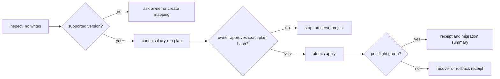

# Versioned migration hybrid plan

## Outcome

An agent can inspect an Owledge project or legacy vault, produce a bounded
version-specific migration plan, wait for the owner, and call one deterministic
engine that either completes with receipts or restores the prior managed state.
The system never infers an unknown source version, rewrites user knowledge, or
updates its own instructions while a migration is running.

## Product boundary

This is post-V1 work. It preserves the eight public Core verbs and five MCP
tools. Migration remains an explicit advanced operation invoked by the skill;
it does not become an automatic init, recall, MCP or agent-hook side effect.

## The hybrid boundary

| Part | Owns | Must not own |
| --- | --- | --- |
| `owledge-migration` skill | Read order, version routing, concise plan, owner questions, stop conditions, evidence handoff | File transforms, heuristics that write, rollback logic |
| Migration engine | Inventory, catalog matching, dry-run, plan hashes, backups, atomic apply, recovery, receipts | Conversational decisions, silent approval, remote update |
| Version catalog | Supported source/target ranges, immutable transforms, allowed paths, required checks | User-specific content or unreviewed mappings |
| Owner | Scope, ambiguous routing, destructive exceptions, exact plan approval | Repeating deterministic commands |

## Agent skill design

The loaded `SKILL.md` stays below 120 lines and contains only the outcome,
four-mode router, hard stops, the fixed output shape, and links to references.
It reads no vault body during inventory and loads one reference only after the
engine has identified a supported version pair.

```text
skills/owledge-migration/
  SKILL.md                    # compact router, no duplicated procedures
  agents/openai.yaml          # discovery metadata
  references/version-matrix.md # only for detected source/target pair
  references/approval.md      # plan-review and escalation contract
  references/recovery.md      # only after failed/interrupted apply
```

Install mirrors remain `skills/owledge-migration/` and
`.agents/skills/owledge-migration/`; `.owledge/skills/` is never presented as a
harness discovery path. The skill uses the installed project-local engine and
never asks an agent to paste, generate or modify a migration script.

### Four compact modes

| Signal | Mode | Read budget | Stop condition |
| --- | --- | --- | --- |
| New or uncertain project/vault | `inspect` | manifest, router files, directory names, hashes | exact source profile or `unknown_version` |
| Supported pair | `plan` | inventory receipt plus one catalog row | plan hash and owner decision request |
| Owner approved exact plan | `apply` | signed plan, preflight receipt, minimal recovery reference | applied receipt or recovered receipt |
| Interrupted or failed run | `recover` | transaction journal plus recovery reference | verified state or explicit blocker |

Every mode emits the same six fields: `detected_version`, `target_version`,
`allowed_actions`, `blocked_items`, `owner_decision`, and `next_command`.
Keep lists capped and link to a receipt instead of inserting bodies, diffs or
full vault trees into agent context.

## Version catalog and self-update

The engine reads a shipped, signed-by-hash JSON catalog. Each row has source and
target version ranges, profile fingerprints, transforms, never-touch paths,
ambiguity rules, positive and negative tests, and a migration schema version.

| Source | Target | Default | Ambiguity |
| --- | --- | --- | --- |
| v0.7 kit with manifest | v0.8 Minimal or explicit Full | preserve all existing folders; add only managed V1 files | map no `lessons/` or `handoffs/` automatically |
| v0.7 custom vault without trustworthy manifest | v0.8 sidecar profile | no source write; build an inventory and candidate map | owner chooses each artifact class or keeps vault unchanged |
| v0.8.x supported manifest | next catalog row | preview-first managed-file update | stop if edited files or catalog mismatch |
| unknown, future or tampered version | none | no write | `unknown_version` with manual mapping request |

"Self-update" means a normal, explicit Owledge upgrade distributes a newer
skill and catalog. The active skill and engine remain immutable for the whole
run; a changed catalog, skill hash or engine hash invalidates the plan and
requires a new dry-run and approval.

## Deterministic engine contract

Extend `tools/owledge_migration.py`; do not create a competing writer.

1. `inspect` writes no project files and reports only metadata, paths, hashes,
   profile evidence and classification confidence.
2. `plan` emits canonical JSON with source and target IDs, catalog hash,
   engine hash, exact allowed writes, no-write exclusions, collisions and a
   plan SHA-256.
3. `apply` accepts only a fresh, approved plan whose hashes and source state
   still match, writes a transaction journal before each managed change, stages
   replacements in the same directory, and records a receipt without knowledge
   bodies.
4. `recover` either completes hash-verified staged work or rolls back managed
   changes. It never guesses between the two.
5. Path validation rejects absolute, parent, UNC, symlink and junction escapes;
   no transform may read or write outside the declared project and explicit
   local Null-Space roots.

## Human-in-the-loop contract



Ask the owner whenever an item could be both a handoff and a lesson, changes
scope, contains private material, maps to user-global knowledge, has no exact
version row, or requires deletion. A refusal, timeout or malformed approval is
always a no-write result.

## Execution plan

| Ticket | Deliverable | Gate |
| --- | --- | --- |
| MIG-01 | Migration catalog schema, source fingerprint contract, v0.7/v0.8 fixture inventory | G-MIG-01-CONTRACT |
| MIG-02 | Canonical inspect and plan engine, hash-bound plan schema, no-body receipts | G-MIG-01-CONTRACT |
| MIG-03 | Atomic apply, journal, rollback/recovery and path-escape corpus | G-MIG-02-RECOVERY |
| MIG-04 | Compact skill, progressive references, discoverable install mirrors and fixed agent output | G-MIG-03-SKILL |
| MIG-05 | Legacy vault routing classifier with `allow`, `deny`, `needs_user_decision` | G-MIG-03-SKILL |
| MIG-06 | End-to-end v0.7 to v0.8 fixtures, edited-file, ambiguous-lesson and Null-Space cases | G-MIG-04-COMPAT |
| MIG-07 | Package/docs compatibility matrix and independent security/recovery QA | G-MIG-04-COMPAT |

WIP stays one writer. Independent QA is required for catalog interpretation,
path safety, apply/recovery and the user-global boundary; normal copy changes
receive focused local tests.

## Acceptance gates

| Gate | Evidence needed |
| --- | --- |
| G-MIG-01-CONTRACT | Unknown or tampered inputs fail closed; catalog and plan JSON validate; v0.7 and v0.8 detection is deterministic. |
| G-MIG-02-RECOVERY | Fault injection after every write restores or completes correctly; user files and never-touch paths remain byte-identical. |
| G-MIG-03-SKILL | A small-context agent selects each mode from the compact entrypoint, loads only the needed reference and asks on ambiguity. |
| G-MIG-04-COMPAT | Fresh fixtures prove v0.7 kit, edited install, custom vault and explicit Null-Space outcomes; no unsupported version or platform claim. |

## Non-goals

No remote update service, cloud backup, full-vault embedding, auto-promotion,
automatic cross-project import, agent-side direct writes, or deletion of legacy
folders. A legacy folder can remain forever if the owner chooses compatibility
over cleanup.
