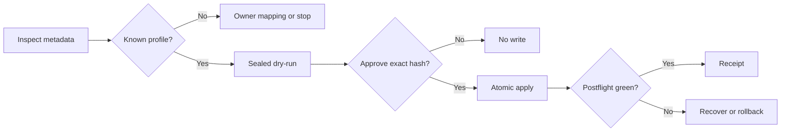

# Versioned migration hybrid plan

## Outcome

An agent inspects an Owledge project or legacy vault, produces a sealed
version-specific plan, waits for approval, and calls one deterministic engine.
The engine completes with receipts or restores managed state. Unknown versions,
ambiguous knowledge routing, stale plans and path escapes stop before writes.

`Sealed` is the leading word for this workflow. A sealed plan binds the source
inventory, catalog, engine, skill and owner approval by hash.

## Product boundary

This is post-V1 work. It preserves the eight public Core verbs and five MCP
tools. Migration stays an explicit advanced operation. It cannot run from init,
recall, MCP calls or lifecycle hooks.

## Hybrid ownership

| Part | Owns | Excludes |
| --- | --- | --- |
| `owledge-migration` skill | Mode selection, read order, concise decision request, stop conditions | File transforms, writable heuristics, rollback |
| Migration engine | Inventory, catalog match, canonical plan, atomic apply, recovery, receipts | Conversational decisions, silent approval, network update |
| Version catalog | Supported pairs, fingerprints, transforms, allowed paths, checks | User content, inferred mappings |
| Owner | Ambiguous routing, deletion, scope and exact sealed-plan approval | Repeating deterministic checks |

## Compact skill contract

The project-wide authoring contract lives in
`internal/owledge/workpackages/skill-authoring-guidance-handoff.md`. The
migration skill is its first full implementation.

```text
skills/owledge-migration/
  SKILL.md
  agents/openai.yaml
  references/contract.md
  references/version-matrix.md
  references/approval.md
  references/recovery.md
  scripts/validate_skill.py
```

`SKILL.md` is a router, capped at 90 lines. It contains only the leading word,
shared safety boundary, mode matrix, fixed output schema and conditional
pointers. Every conditional branch loads at most one primary reference before
running a script. Procedures and examples stay out of the router.

| Signal | Mode | Load | Action | Done when | Route |
| --- | --- | --- | --- | --- | --- |
| Version uncertain | `inspect` | manifest, names, hashes | metadata-only inventory | exact profile or `unknown_version` | `contract.md` |
| Supported pair | `plan` | receipt plus one catalog row | emit sealed dry-run | plan hash and decision request exist | `version-matrix.md` |
| Exact hash approved | `apply` | sealed plan and preflight | call engine | applied or recovered receipt exists | `approval.md` |
| Interrupted run | `recover` | journal and receipt IDs | call recovery | verified state or blocker exists | `recovery.md` |

Every mode emits six bounded fields: `detected_version`, `target_version`,
`allowed_actions`, `blocked_items`, `owner_decision`, `next_command`. Lists are
capped. Bodies, full trees and full diffs remain in receipts outside context.

Install mirrors remain `skills/owledge-migration/` and
`.agents/skills/owledge-migration/`. Plugin bundles use their declared skill
roots. `.owledge/skills/` is not a harness discovery path.

## Version catalog and updates

The engine reads a shipped JSON catalog whose hash enters every sealed plan.
Each row declares source and target ranges, fingerprints, transforms,
never-touch paths, ambiguity rules, checks and migration schema version.

| Source | Target | Default | Ambiguity result |
| --- | --- | --- | --- |
| v0.7 kit with trusted manifest | v0.8 Minimal or explicit Full | preserve legacy folders; add managed files | lessons and handoffs stay unmapped |
| v0.7 custom vault | v0.8 sidecar | source stays unchanged | owner classifies each artifact group |
| v0.8.x trusted manifest | next catalog row | preview managed updates | edited files stop or remain untouched |
| Unknown, future or tampered | none | no write | `unknown_version` |

Self-update means a normal explicit Owledge upgrade ships a newer skill,
engine and catalog. A running migration never mutates them. Any hash change
invalidates the plan and requires a fresh preview and approval.

## Deterministic engine contract

Extend `tools/owledge_migration.py`. Do not add a second writer.

1. `inspect` reads metadata and hashes only. It writes nothing.
2. `plan` emits canonical JSON with source, target, catalog hash, engine hash,
   skill hash, exact writes, exclusions, collisions and plan SHA-256.
3. `apply` accepts one fresh approved hash. It journals before each change,
   stages in the target directory, replaces atomically and records no bodies.
4. `recover` completes verified staged work or rolls back managed changes. It
   never chooses between outcomes by guess.
5. Path checks reject absolute, parent, UNC, network, symlink and junction
   escapes. Reads and writes stay inside the declared project and explicit
   local Null-Space roots.

## Approval flow



Owner input is required for mixed artifact types, private material, global
promotion, deletion, scope changes and unsupported catalog rows. Missing,
expired or malformed approval returns no-write.

## Phased delivery

| Phase | Tickets | Result | Gate |
| --- | --- | --- | --- |
| 1. Contract | MIG-01, MIG-02 | Catalog schema, fixtures, canonical inspect and plan | G-MIG-01-CONTRACT |
| 2. Recovery | MIG-03 | Atomic apply, journal, rollback, fault injection | G-MIG-02-RECOVERY |
| 3. Skill | MIG-04, MIG-05 | Compact router, mirrors, ambiguity classifier | G-MIG-03-SKILL |
| 4. Compatibility | MIG-06 | v0.7, edited kit, custom vault and Null-Space journeys | G-MIG-04-COMPAT |
| 5. Release readiness | MIG-07 | Package, docs, security and independent QA | G-MIG-05-READY |

### Ticket completion criteria

| Ticket | Checkable completion criterion |
| --- | --- |
| MIG-01 | Identical inputs produce byte-identical catalog matches; unsupported inputs produce no candidate writes. |
| MIG-02 | A second process verifies source, catalog, engine, skill and plan hashes. |
| MIG-03 | Fault injection after every write proves complete new state or byte-identical prior state. |
| MIG-04 | Every router cell reaches one existing resource without loading unrelated references; maintainer instructions point future skill edits to the authoring handoff. |
| MIG-05 | An ambiguous learning never becomes a handoff or global record without approval. |
| MIG-06 | Never-touch content stays byte-identical and every journey emits a privacy-safe receipt. |
| MIG-07 | The install artifact contains the same validated skill, catalog and engine hashes as tested source. |

## Gates and tests

| Gate | Required evidence |
| --- | --- |
| G-MIG-01-CONTRACT | Schema tests, deterministic detection, canonical plan replay, unknown-version negatives |
| G-MIG-02-RECOVERY | Per-write fault injection, stale journal, edited-file, path and reparse negatives |
| G-MIG-03-SKILL | Router under 90 lines, valid links, mirror parity, branch load budget, small-context behavior eval |
| G-MIG-04-COMPAT | Four end-to-end fixtures, owner-decision cases, Null-Space isolation, no-body receipts |
| G-MIG-05-READY | Clean build, artifact inventory, offline install, docs truth, independent QA |

Behavior tests use realistic prompts and assert mode, loaded references,
commands, stops and receipts. Snapshot tests of wording do not count. Run one
small-context profile and one frontier profile against the same fixture set.
Record model and tokenizer limits as evidence, not product claims.

## Complexity budget

| Item | Limit |
| --- | --- |
| Public Core verbs | stays at 8 |
| MCP tools | stays at 5 |
| New migration writer modules | 0 |
| Router length | at most 90 lines |
| Primary reference loaded per branch | at most 1 before script execution |
| New runtime dependencies | 0 unless a measured blocker is approved |
| Unapproved source content rewrites | 0 |

## Authoring-standard adoption

MIG-04 also adds one short context pointer from maintainer instructions and the
project skill validator to the authoring handoff. The pointer triggers only for
skill creation or substantial skill revision. The validator enforces
frontmatter, router line budget, decision-matrix fields, valid conditional
links and mirror parity. Behavioral quality remains a gate because static text
checks cannot prove correct routing.

After G-MIG-05-READY, create a ranked modernization backlog for existing
skills. Rank by always-loaded context cost, routing ambiguity, safety risk and
mirror drift. Change one skill per ticket with baseline fixtures. Do not mix
this audit into migration release readiness.

## Non-goals

No remote update service, cloud backup, full-vault embedding, automatic
promotion, automatic cross-project import, agent-side direct writes or legacy
folder deletion. A legacy folder may remain indefinitely.

## Resume state

Plan and authoring guidance are ready for owner review. Start `MIG-01` only
after creating a separate post-V1 control plane. The completed V1M control
plane remains historical and unchanged.
