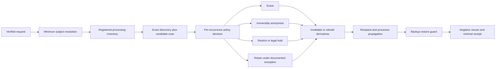

# Enterprise Agentic Knowledge and Deterministic Erasure Architecture

## Scope and legal limit

This research separates three questions that should not be implemented as one feature:

1. How an enterprise should classify and govern human and agentic knowledge.
2. How a person can be resolved across known systems without creating an unnecessary central identity database.
3. How an authorised erasure, anonymisation, restriction, or retention decision can be propagated and verified across canonical sources and derived copies.

The legal section is architecture research, not legal advice. Whether an Article 17 ground or exception applies, whether anonymisation is sufficiently irreversible, and which retention duties prevail remain deployment- and jurisdiction-specific decisions for the controller and its data protection/legal function.

## Executive verdict

**Removing or masking a name is not enough.** A name is only one possible identifier. E-mail addresses, employee IDs, project roles, quotations, timestamps, behavioural patterns, relationships, and combinations of otherwise ordinary attributes can still identify or single out a person. Pseudonymised data remains personal data when it can be attributed to a person with additional information. Only information rendered genuinely anonymous so that the person is no longer identifiable falls outside the GDPR. [GDPR Articles 4 and Recital 26](https://eur-lex.europa.eu/eli/reg/2016/679/art_4/oj), [EDPB overview on anonymisation and pseudonymisation](https://www.edpb.europa.eu/topics/ai-and-technology/anonymisationpseudonymisation_en), and [EDPB Guidelines 01/2025 on Pseudonymisation](https://www.edpb.europa.eu/public-consultations/guidelines-012025-on-pseudonymisation_en).

Owledge should therefore not promise to "find and delete a person everywhere" through one masking library. It can credibly provide a **coverage-bounded, deterministic erasure control plane**:

- registered systems, stores, processors, exports, and derivations define the coverage boundary;
- a verified request and minimum necessary identity evidence establish the subject reference;
- a dry-run plan classifies every discovered occurrence as `erase`, `anonymize`, `restrict`, or `retain_under_exception`;
- idempotent adapters execute the plan and return receipts;
- derived indexes, caches, summaries, and exports are invalidated or rebuilt;
- a restore guard prevents backups from resurrecting erased content;
- negative rescans and health gates show what was verified and what remains unresolved.

This is an enterprise-viable extension of Owledge's canonical Markdown/Git model. It is not a universal privacy-management suite and should not become one in V1 Beta.

## 1. Enterprise knowledge requires several governed classes

ISO public material describes knowledge management as capturing, conveying, and transforming knowledge for organisational value, while the revised ISO 15489 principles treat records as authoritative evidence whose content and metadata preserve context, authenticity, reliability, integrity, and usability. Both require policy, responsibility, monitoring, and lifecycle control rather than an undifferentiated document pile. [ISO 30401 public overview](https://www.iso.org/files/live/sites/isoorg/files/store/en/PUB100444.pdf) and [ISO 15489 revised principles](https://www.iso.org/home.isoDocumentsDownload.do?t=ieHkWblRDvFnWT3XDviIIV9SHZnpbYrw3W_44ExKX-8EeHQbvZkHab3bO9tesz_2).

Agent-memory research adds a useful but different distinction. Systems such as AdMem separate semantic, episodic, and procedural memory, while hierarchical systems retain lower-level evidence beneath consolidated summaries. Those categories describe cognitive or retrieval function; they do not define legal authority, retention, or enterprise scope. [AdMem](https://arxiv.org/abs/2606.06787) and [HORMA](https://arxiv.org/abs/2606.11680).

Owledge should combine, but not conflate, the two views:

| Knowledge class | Examples | Authority and default lifecycle | Personal-data risk |
| --- | --- | --- | --- |
| Working context | Current prompt bundle, active tool results, temporary plan state | Ephemeral and budgeted; never canonical by itself | High if raw session content is hydrated |
| Episodic evidence | Session handoff, event, experiment, agent attempt, failure trace | Short/medium retention; candidate evidence requiring review | Often high; conversations and activity histories concern people |
| Semantic knowledge | Reviewed fact, reusable lesson, global essence, research finding | Versioned, provenance-bound, freshness-reviewed | May retain indirect or inferred personal data after name removal |
| Procedural knowledge | Runbook, policy, skill, validation rule, incident procedure | Reviewed and versioned; superseded rather than silently rewritten | Usually lower, unless examples or attribution identify people |
| Decision and project record | ADR, approval, plan, requirement, test evidence | Canonical business record; retention based on record class and legal context | Names, roles, opinions, and authorship can all be personal data |
| User/person profile | Preferences, goals, coaching note, employee/customer context | Private and purpose-limited; explicit retention and access rules | Intrinsically personal; potentially special-category or inferred data |
| Research source and finding | Paper metadata, source extract, reason for research, distilled result | Source-linked, freshness-aware, promotable from project to global essence | Usually low, but annotations can mention employees/customers |
| Security audit record | Actor, capability, target, result, time, policy/revision | Minimal, access-restricted, tamper-evident, policy retention | Actor IDs and behaviour are personal data; avoid content by default |
| Derived retrieval view | Search index, embedding, cache, knowledge graph projection | Disposable and rebuildable; never independently canonical | Still personal if vectors, metadata, or links relate to a person |
| Legal-hold/retention record | Exception, hold basis, expiry, approver, restricted object | Separated and tightly restricted until the basis expires | Personal data remains; this is restriction/retention, not erasure |

### Lifecycle contract

The lifecycle should be explicit for every durable class:

`capture -> classify -> validate -> review/promote -> retrieve/hydrate -> monitor -> supersede/retain -> erase/anonymise/restrict -> verify/rebuild`

Every transition needs an owner, policy version, source revision, effect receipt, and permitted next states. Agents may propose classification, extraction, promotion, and deletion candidates; they should not autonomously decide legal grounds, exceptions, or irreversible enterprise deletion.

## 2. Legal distinction: masking, pseudonymisation, anonymisation, and erasure

| Operation | What it does | GDPR status | Appropriate use |
| --- | --- | --- | --- |
| Display masking | Hides part or all of a value in one view while the original remains | Personal data remains; no erasure | UI, logs, lower-privilege display |
| Tokenisation/pseudonymisation | Replaces direct identifiers while separately retaining a re-linking capability | Personal data remains | Risk reduction, least-privilege processing, controlled analytics |
| Redaction | Removes selected spans from one representation | Depends on residual identifiability and other copies | Sanitised export or transformed document, followed by verification |
| Anonymisation | Makes the person no longer identifiable by reasonably likely means | Truly anonymous output is outside GDPR | Retaining non-personal aggregate/knowledge when irreversibility is evidenced |
| Erasure/destruction | Removes the personal data and prevents ordinary recovery/continued processing | Fulfils an applicable erasure decision when propagated adequately | Default for a valid Article 17 case without an exception |
| Restriction/legal hold | Technically blocks ordinary processing while retaining a justified record | Still personal data | Conflicting legal retention, claims, or temporary decision state |

The former Article 29 Working Party's still-useful anonymisation test asks whether a person can be singled out, records can be linked, or information can be inferred. It warns that removing direct identifiers is generally insufficient. [Opinion 05/2014 on Anonymisation Techniques](https://ec.europa.eu/justice/article-29/documentation/opinion-recommendation/files/2014/wp216_en.pdf). NIST likewise warns that de-identification is not a single field-removal operation and that re-identification risk must be managed for structured data, free text, multimedia, and images. [NISTIR 8053](https://www.nist.gov/publications/de-identification-personal-information) and [NIST SP 800-188](https://csrc.nist.gov/pubs/sp/800/188/final).

### Does a PII Masker solve this?

No. The owner meant a **PII Masker**, not the `pymasking` package previously
evaluated here. No exact package or repository has been identified, so this
research must not attribute product-specific guarantees. Architecturally, a PII
masking tool can be evaluated later as one pluggable candidate-detection or
redaction adapter. It does not by itself establish complete identity discovery,
lineage propagation, backup handling, recipient notification, re-identification
testing, legal-basis decisions, or deletion guarantees.

A PII Masker must therefore not be the compliance boundary. Its output can
remain pseudonymous, incomplete, or linkable, and creating a transformed copy
does not delete the original or its Git history. An exact tool evaluation
requires the package name or repository from the owner.

## 3. GDPR requirements that shape the architecture

| Requirement | Architecture implication |
| --- | --- |
| Purpose limitation, minimisation, accuracy, storage limitation, security, and accountability under Article 5 | Every knowledge class needs purpose, data category, retention, access, review, and deletion policy plus measurable evidence. [GDPR Article 5](https://eur-lex.europa.eu/eli/reg/2016/679/art_5/oj) |
| No duty to retain or acquire extra identifiers solely to answer rights requests when identification is otherwise unnecessary; the subject may provide additional resolving information | Do not build a mandatory organisation-wide cleartext identity graph "just in case". Resolve identity within the verified request and source contexts using the minimum attributes needed. [GDPR Article 11](https://eur-lex.europa.eu/eli/reg/2016/679/art_11/oj) |
| Facilitate rights, verify identity proportionately when doubts exist, normally answer within one month, and notify a permitted extension within that month | Model request, verification, deadline, extension, refusal/exception rationale, and response as explicit states. [GDPR Article 12](https://eur-lex.europa.eu/eli/reg/2016/679/art_12/oj) |
| Erase without undue delay when an Article 17(1) ground applies; apply the Article 17(3) exceptions only to the necessary extent | Decide per occurrence. A valid request does not imply deleting legally required payroll, claim, or public-interest records, but an exception does not justify retaining unrelated copies. [GDPR Article 17](https://eur-lex.europa.eu/eli/reg/2016/679/art_17/oj) |
| Communicate erasure, rectification, or restriction to recipients unless impossible or disproportionate | Track processors, exports, downstream systems, and recipients; issue propagation commands and retain non-content receipts. [GDPR Article 19](https://eur-lex.europa.eu/eli/reg/2016/679/art_19/oj) |
| Privacy by design/default across the lifecycle | Erasure and anonymisation are Core contracts and health gates, not an after-the-fact cleanup script. [GDPR Article 25](https://eur-lex.europa.eu/eli/reg/2016/679/art_25/oj) and [EDPB Guidelines 4/2019](https://www.edpb.europa.eu/system/files/documents/files/file1/edpb_guidelines_201904_dataprotection_by_design_and_by_default_v2.0_en.pdf) |
| Records of processing include categories of people/data/recipients, envisaged erasure periods, and security measures | A source/processor/connector inventory is the basis for any credible system-wide discovery claim. [GDPR Article 30](https://eur-lex.europa.eu/eli/reg/2016/679/art_30/oj) |

The EDPB's final access guidance makes the discovery scope broader than account master data: personal data may appear in activity and communication history, logs, derived assessments, and both IT and non-IT filing systems. Search methods must fit the structure and context of the stored data. [EDPB Guidelines 01/2022, final version](https://www.edpb.europa.eu/documents/guideline/guidelines-012022-on-data-subject-rights-right-of-access_en).

## 4. Identity resolution without an identity-surveillance database

Owledge needs **subject resolution**, not name search.

### Minimum subject-resolution object

An erasure case should temporarily bind a non-semantic `subject_ref` to verified, permitted search claims such as customer/employee ID, controlled account IDs, known e-mail variants, and exact source-system IDs. Names can be one signal but should not be the sole join key. NIST identity-resolution guidance similarly treats name, address, birth date, e-mail, and phone as variable attributes and requires collection to be limited to the minimum necessary to resolve a unique identity in the relevant population and context. [NIST SP 800-63A implementation resources](https://pages.nist.gov/800-63-3-Implementation-Resources/63A/resolution/).

The claims should be encrypted, access-restricted, purpose-bound to the case, and expired after closure unless retention of the request evidence is legally justified. Durable receipts should keep the case ID, policy, scope, counts, outcomes, and timestamps—not the person's name or a replayable identifier.

### Deterministic and probabilistic parts

| Part | Can be deterministic? | Required evidence |
| --- | --- | --- |
| Exact lookup by registered subject ID or alias | Yes, within the registered source | Query and connector receipt |
| Traversal from canonical artifact to known index/cache/export | Yes, with complete derivation edges | Source revision, derivative IDs, rebuild receipt |
| Policy evaluation from declared facts | Yes, after authorised legal/policy input | Policy version and decision explanation |
| Free-text discovery of aliases, paraphrases, inferred attributes, images, or embeddings | No completeness guarantee | Detector versions, confidence, review queue, negative rescan |
| Coverage of unknown databases, local clones, screenshots, or shadow IT | No | Coverage report must show them as unregistered/unverified |

The strongest honest guarantee is therefore: **deterministic execution and verification over a declared, health-checked processing inventory**. Owledge should fail closed or report incomplete coverage rather than claim universal deletion.

NIST's Privacy Framework makes this inventory foundation explicit: organisations inventory systems/services, owners and operators, categories of individuals, data actions, purposes, data elements, processing environments, and data flows. [NIST Privacy Framework 1.0, Inventory and Mapping](https://nvlpubs.nist.gov/nistpubs/CSWP/NIST.CSWP.01162020.pdf).

## 5. Recommended Owledge erasure control plane

### Core contracts

| Contract | Minimum fields and invariant |
| --- | --- |
| `processing_inventory` | Store/connector owner, scope, data categories, subject-key capabilities, source of truth, derivatives, recipients, retention, last health check |
| `subject_resolution` | Case-bound opaque subject reference, verified claims, claim provenance, allowed query scopes, expiry; no unnecessary global profile |
| `erasure_plan` | Every occurrence, source revision/hash, purpose/basis, retention/hold status, action, responsible adapter, deadline, dependencies |
| `erasure_command` | Idempotency key, expected document/store revision, target identity, authorised action, policy version, dry-run/execute mode |
| `propagation_receipt` | Connector, affected object/revision, action/result, counts, timestamp, residual/exception state; no erased content |
| `deletion_ledger` | Opaque tombstone preventing re-ingestion or restoration, bounded to necessary non-content identity material and retention |
| `health_report` | Inventory coverage, connector freshness, unconfirmed actions, restore-test age, unregistered derivatives, stale legal holds |

### Human control

An agent may generate the discovery plan, propose per-occurrence actions, explain conflicts, and run reversible dry-runs. An authorised human or deterministic policy authority must approve irreversible deletion, anonymisation thresholds, and legal exceptions. BSI archive guidance likewise recommends strict authorisation, reasons, logging, and—for critical archive deletion—a four-eyes principle. [BSI TR-ESOR guidance, section 2.8.3.5](https://www.bsi.bund.de/SharedDocs/Downloads/DE/BSI/Publikationen/TechnischeRichtlinien/TR03125/BSI_TR-ESOR-leitlinie_1_3.pdf?__blob=publicationFile&v=4).

## 6. Markdown/Git canonical knowledge: special constraints

### Preferred design

Do not place direct personal identifiers in Git-canonical knowledge by default. Keep protected identity attributes in the appropriate customer source or a dedicated encrypted subject vault; Markdown should use an opaque `subject_ref` only when the knowledge genuinely needs a person relation. For most global essences and reusable research, remove the person relationship entirely during promotion.

Owledge-managed artifacts containing personal data should declare machine-readable governance metadata, for example:

- `contains_personal_data` and data categories;
- opaque `data_subject_refs` where justified;
- purpose/lawful-basis reference and controller/owner;
- retention class, review and deletion eligibility;
- source and derivative edges;
- export/processor destinations;
- legal-hold state.

Do not expose these fields as a free-form invitation to agents. Their allowed values and transition rules belong in the central schema/settings/validator contract.

### Why a normal Git edit is not erasure

Deleting a line, file, or branch in a new commit does not remove it from earlier Git objects, reflogs, mirrors, or clones. If plaintext personal data was committed, a valid erasure case may require controlled history rewriting and garbage collection on every controlled repository plus downstream notification. Independent clones and exports remain separate copies that must be handled through governance and recipient obligations.

A new redacted Markdown revision should receive the normal `document_version` bump and a non-content effect receipt. That preserves current-document integrity, but **the version bump alone is not erasure of previous Git history**.

Per-subject envelope encryption and destruction of the subject key can reduce the history-rewrite problem only when every relevant copy contains ciphertext, the plaintext never entered Git/logs/exports, and all wrapping keys and replicas are controlled. NIST calls cryptographic erase a media sanitisation technique whose assurance depends on encryption and key-sanitisation conditions; it is not by itself a legal conclusion about a distributed personal-data case. [NIST SP 800-88 Rev. 2](https://csrc.nist.gov/pubs/sp/800/88/r2/final).

For integrity-protected append-only structures, NIST has separately demonstrated that deletion-compatible hash-linked data structures are possible. That supports keeping tamper evidence and erasure compatible, but it does not remove the need to find derivatives and recipients. [NIST CSWP 25](https://csrc.nist.gov/pubs/cswp/25/data-structure-for-integrity-protection-with-erasu/final).

## 7. Derived indexes, embeddings, summaries, logs, exports, and providers

Derived structures remain personal data if they relate to an identifiable person. Their safest Owledge contract is **disposable, versioned, and rebuildable**:

1. Erase or transform the canonical occurrence according to the approved action.
2. Traverse declared derivation edges to global essences, indexes, caches, knowledge graphs, embeddings, and exports.
3. Delete affected entries or rebuild the namespace exclusively from authorised current sources.
4. Mark source-dependent essences stale or regenerate them; never leave a global summary that still reveals the removed person.
5. Propagate the command to processors/providers where the contract and data flow require it and record the response.
6. Run exact negative queries and policy scans before closing the case.

Vector embeddings should not be treated as anonymous merely because a human cannot read them. If their source concerned a person or linkage can be recovered through metadata/retrieval, remove and rebuild them.

Runtime traces and security audits should be separate. Trace content should have a short TTL and default to IDs/timings rather than full prompts. Security receipts should retain accountability without the erased content. Otherwise the proof of deletion becomes a fresh personal-data copy.

## 8. Backups and restores

CNIL explicitly recommends either erasure in backups or another mechanism that prevents erased personal data from being restored. [CNIL engineering guidance for data-subject rights](https://www.cnil.fr/en/sheet-ndeg13-prepare-exercise-peoples-rights). The UK ICO's operational guidance adds a useful implementation pattern: where immediate overwrite is not technically feasible, backup data should be put beyond use, used for no other purpose, and expire under an established replacement schedule, with transparent communication to the person. [ICO Right to Erasure guidance](https://ico.org.uk/for-organisations/uk-gdpr-guidance-and-resources/individual-rights/individual-rights/right-to-erasure/?q=backup).

Owledge should implement:

- immutable backup-set inventory and expiry schedule;
- encrypted backups with controlled keys;
- a deletion ledger outside normal content retrieval;
- a restore pipeline that reapplies all still-valid deletion/restriction tombstones before the restored system can serve users or agents;
- scheduled restore tests proving that erased identities do not reappear;
- explicit RPO/RTO and responsibility boundaries for customer-owned Git/Markdown versus Hub-owned state.

Physical media sanitisation (`clear`, `purge`, or `destroy`) is required when the store/media lifecycle demands it, but it does not replace record-level propagation in a running enterprise system. NIST SP 800-88 Rev. 2 requires an organisation-level sanitisation programme with validation and evidence appropriate to the media and confidentiality risk. [NIST publication notice](https://www.nist.gov/news-events/news/2025/09/guidelines-media-sanitization-nist-publishes-sp-800-88r2).

## 9. Standards map

| Source | Use for Owledge | Limit |
| --- | --- | --- |
| [ISO/IEC 27555:2021](https://www.iso.org/standard/71673.html) | Organisational PII deletion policies, roles, rules, procedures, documentation | Does not prescribe the concrete deletion mechanism |
| [ISO/IEC 27559:2022](https://www.iso.org/standard/71677.html) | De-identification framework and re-identification risk across the data lifecycle | Does not turn field masking into automatic anonymisation |
| [ISO 30401 public overview](https://www.iso.org/files/live/sites/isoorg/files/store/en/PUB100444.pdf) | Knowledge-management system and organisational value perspective | Not an agent-memory storage schema |
| [ISO 15489 revised principles](https://www.iso.org/home.isoDocumentsDownload.do?t=ieHkWblRDvFnWT3XDviIIV9SHZnpbYrw3W_44ExKX-8EeHQbvZkHab3bO9tesz_2) | Authoritative records, contextual metadata, policy/responsibility/monitoring | Record retention can conflict with immediate deletion and needs legal classification |
| [NIST Privacy Framework 1.0](https://nvlpubs.nist.gov/nistpubs/CSWP/NIST.CSWP.01162020.pdf) | Processing inventory, data-flow mapping, privacy risk governance | Voluntary framework; not EU legal advice |
| [NIST SP 800-188](https://csrc.nist.gov/pubs/sp/800/188/final) | De-identification governance and measurable re-identification risk | Technical guidance; not a GDPR adequacy ruling |
| [NIST SP 800-88 Rev. 2](https://csrc.nist.gov/pubs/sp/800/88/r2/final) | Media sanitisation, cryptographic erase, validation and evidence | Media-level scope, not distributed subject-record discovery |

## 10. Bounded product recommendation

### V1 Beta: contract and reference proof, not universal connector suite

1. Define the source/derivative/recipient registry, opaque subject reference, four policy actions, idempotent erasure command, receipts, deletion ledger, and restore guard in the Core contract.
2. Implement one Markdown/Git reference adapter and one disposable local index/cache adapter.
3. Add a health gate for inventory coverage, stale connectors, pending receipts, expired legal holds, and restore-test age.
4. Demonstrate that a deleted subject occurrence disappears from current Markdown, permitted Git history within the controlled test fixture, search index, compiled context, global essence, export, and a restored backup fixture.
5. Keep irreversible execution behind explicit authority and a dry-run impact plan.

### Post-V1 / enterprise integration work

- HR, CRM, SQL, document storage, cloud, SaaS, SIEM, and model-provider connectors;
- customer-specific retention and legal-hold packs;
- full identity governance integrations;
- certified anonymisation/re-identification assessment workflows;
- large-scale history-rewrite/mirror orchestration;
- DPO/admin UI and case-management reporting.

This cut preserves Owledge's focus. Owledge becomes the deterministic knowledge-policy and propagation layer for registered knowledge systems, not a replacement for every database, identity provider, DLP scanner, records-management platform, or privacy case-management product.

## Conclusion

Owledge can make enterprise knowledge both agent-usable and governable if it keeps three invariants:

1. Different knowledge and memory classes have different authority, retention, and promotion rules.
2. Canonical knowledge preserves provenance while derived retrieval structures remain disposable and reconstructible.
3. Erasure is a verified lifecycle transition over a declared processing graph—not a name replacement in one file.

The credible promise is: **within the registered and continuously health-checked Owledge coverage boundary, every authorised erasure decision is planned, propagated, restored safely, and evidenced deterministically; outside that boundary, missing coverage is reported explicitly.**
